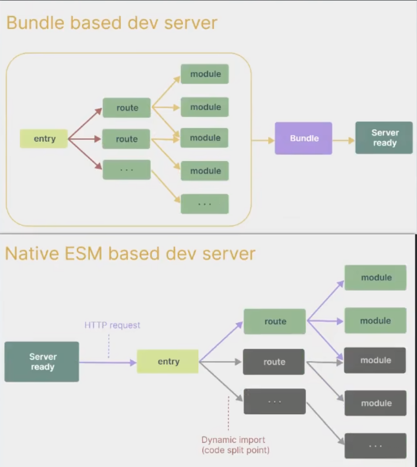
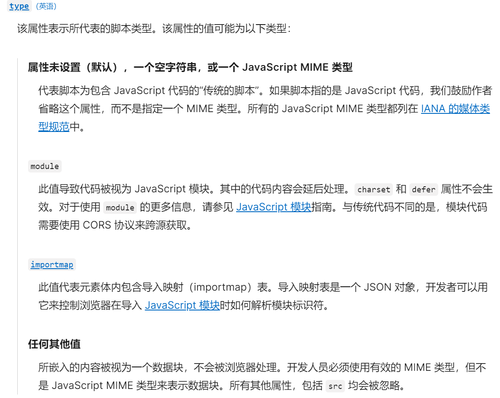
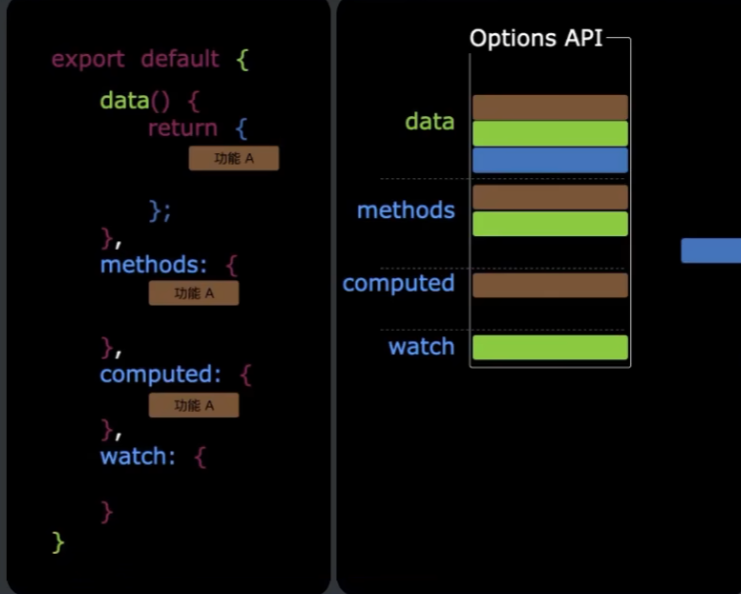
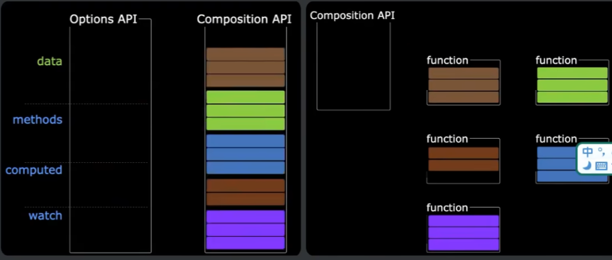
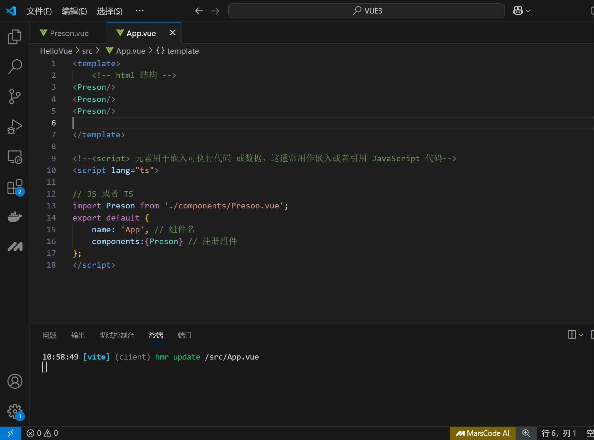
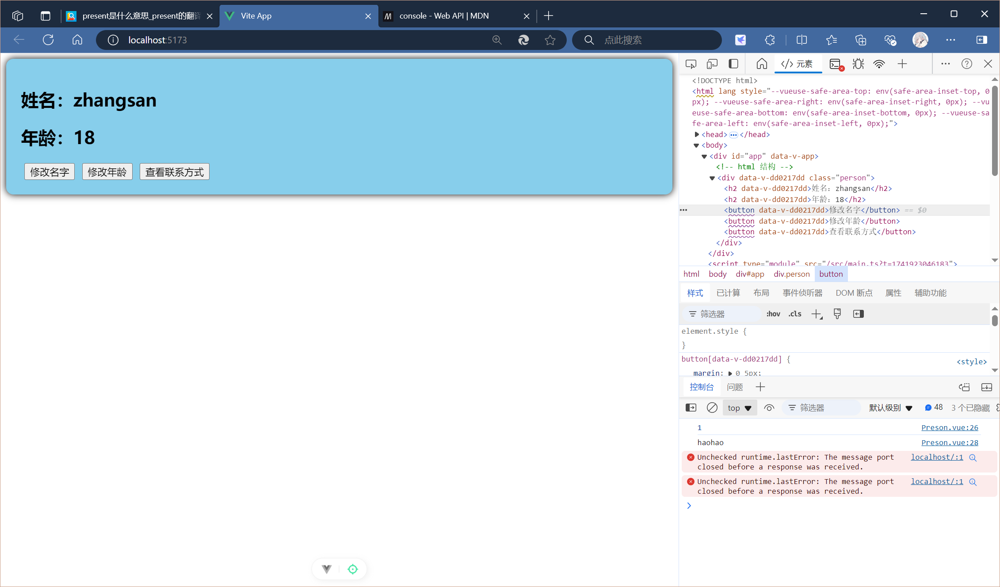

# 各函数的定义及其用法

## alert

`alert()` 是 JavaScript 中的一个内置函数，用于在浏览器中弹出一个警告框，显示指定的消息。通常括号中直接返回上面定义的数据


## data()

在 Vue 组件中，`data` 是一个函数，它返回一个对象。使用函数形式的 `data` 是为了确保每个组件实例都有自己独立的数据副本。如果 `data` 是一个普通对象，那么所有组件实例将共享同一个数据对象，这会导致数据在不同实例之间相互影响，不符合组件化开发的原则。

```vue
data(){
	return{
	
	}
}
```


## button

**`<button>` 元素**表示一个可点击的按钮，可以用在[表单](https://developer.mozilla.org/zh-CN/docs/Learn_web_development/Extensions/Forms)或文档其他需要使用简单标准按钮的地方。


## console

**`console`** 对象提供了浏览器控制台调试的接口

**`console.log()`** 方法向 Web 控制台输出一条信息。这条信息可能是单个字符串（包括可选的替代字符串），也可能是一个或多个对象。


## beforeCreate()

在实例初始化完成并且 props 被解析后立即调用。

接着 props 会被定义成响应式属性，`data()` 和 `computed` 等选项也开始进行处理。

注意，组合式 API 中的 `setup()` 钩子会在所有选项式 API 钩子之前调用，`beforeCreate()` 也不例外。


## defineOptions()

- 仅在 3.3+ 中支持

这个宏可以用来直接在 `<script setup>` 中声明组件选项，而不必使用单独的 `<script>` 块：

- 这是一个宏定义，选项将会被提升到模块作用域中，无法访问 `<script setup>` 中不是字面常数的局部变量。

```
<script lang="ts">
  defineOptions({
  name: 'Person'
})
</script>
```


# vite介绍

vite是新一代前端构建工具，其特点有

- 轻量快速的热重载（HMR）能实现急极速的服务启动

- 对TypeScript，JSX，CSS等支持开箱即用，不需要另外去配置

- 真正的按需编译，不再等待整个应用编译完成

- webpack构建与vite构建对比如下。图一为webpack 图二为vite

  

# 使用cmd部署一个项目

```vue
## 创建命令
npm create vue@latest
```

```vue
## 具体配置
## 配置项目名称
✔ Project name: … <your-project-name>
    
## 是否添加TypeScript支持    
✔ Add TypeScript? … No / Yes  YES
    
## 是否添加JSX支持
✔ Add JSX Support? … No / Yes	NO
    
## 是否添加路由环境    
✔ Add Vue Router for Single Page Application development? … No / Yes	NO

## 是否添加Pinia环境
✔ Add Pinia for state management? … No / Yes	NO
    
## 是否添加单元测试    
✔ Add Vitest for Unit testing? … No / Yes	NO
    
## 是否添加端到端测试方案    
✔ Add an End-to-End Testing Solution? … No / Cypress / Nightwatch / Playwright	NO
    
## 是否添加ESLint语法检查   (每个公司有不同的代码规范，我们学习的时候选择NO，可以随意写代码，不必有局限)
✔ Add ESLint for code quality? … No / Yes	NO
    
## 是否添加Prettiert代码格式优化    
✔ Add Prettier for code formatting? … No / Yes

## 是否添加Vue DevTools 7扩展以进行调试    
✔ Add Vue DevTools 7 extension for debugging? (experimental) … No / Yes

Scaffolding project in ./<your-project-name>...
Done.
```

main.js介绍

```js
// 引用createApp用于创建应用
import { createApp } from "vue";

// 引用App根组件
import App from "./App.vue";

createApp(App).mount('#app')
```

.vue介绍

```vue
<!--HTML 内容模板（<template>）元素是一种用于保存客户端内容机制，该内容在加载页面时不会呈现，但随后可以 (原文为 may be) 在运行时使用 JavaScript 实例化。-->
<template>
    <!-- html 结构 -->
     <div class="app">
        <h1>
            你好啊!
        </h1>
     </div>
</template>

<!--<script> 元素用于嵌入可执行代码或数据，这通常用作嵌入或者引用 JavaScript 代码-->
<script lang="ts">
 // JS 或者 TS
    export default{
        name:'App' // 组件名
    }
</script>

<!--style 属性指定了指定其元素的样式信息。它的功能与 HTML 中的 style 属性相同。-->
<style>
    .app{
        /**背景 阴影 圆角 内边距 */
        background-color: rgb(44, 139, 0);
        box-shadow: aquamarine;
        border-radius: 50px;
        padding: 50px;
    }
</style>
```

总结

- Vite项目中，index.html是项目的入口文件，在项目的最外层

- 加载index.html后Vite解析<script type="module" src "xxx">  指向的JavaScript

- Vue3中是通过createApp函数创建一个应用实例

  


# 实现一个简单的效果

Person

```vue
<template>
    <div class="person">
        <h2>姓名：{{name}}</h2> 
        <h2>年龄：{{ age }}</h2>
        <button @click="ChangeName">修改名字</button>
        <button @click="ChangeAge">修改年龄</button>
        <button @click="showTel">查看联系方式</button>
    </div>
</template>

<script lang="ts">
    export default{
        name:'Person',
        data(){
            return{
                name:'张三',
                age:18,
                tel:'12141231'
            }
        },
        // 在 JavaScript 里，函数有自己的作用域。如果不使用 this，直接访问 tel，JavaScript 会在当前函数的作用域中查找 tel 变量，而不是在组件实例的数据对象里查找。
        methods:{
            showTel(){
                alert(this.tel)
            },
            ChangeName(){
                this.name = "haohao"
            },
            ChangeAge(){
                this.age += 1
            }
        }
    }

</script>

<style scoped>
/* 在 Vue 的模板中，button 是 HTML 原生标签，不需要加 .；而 person 在 <style scoped> 里是一个类名，类名在 CSS 选择器中需要以 . 开头。 */
.person{
    background-color:skyblue;
    box-shadow: 0 0 10px;
    border-radius: 10px;
    padding: 20px;
}
    button{
        margin: 0 5px;
    }

</style>
```

APP

```vue
<template>
    <!-- html 结构 -->
    <div class="app">
        <h1>
            你好啊！
        </h1>
                <!-- 在 <template> 标签中，能够像使用HTML标签一样使用已经注册的组件。所以，<Preson/> 就是在使用 Preson 组件。当这个组件被渲染时，Vue会去加载 Preson.vue 文件里的模板、脚本和样式，然后把它们渲染到页面上。 -->
        <Preson/>
    </div>
</template>

<!--<script> 元素用于嵌入可执行代码 或数据，这通常用作嵌入或者引用 JavaScript 代码-->
<script lang="ts">

// JS 或者 TS
// 在 <script> 标签内，借助 import 语句引入 Preson 组件，并且在 export default 对象里注册这个组件：
import Preson from './components/Preson.vue';
export default {
    name: 'App', // 组件名
    components:{Preson} // 注册组件
};
</script>

<style>
    .app {
        /**背景 阴影 圆角 内边距 */
        background-color: rgb(110, 153, 238);
        box-shadow: aquamarine;
        border-radius: 50px;
        padding: 50px;
    }
</style>
```


# 两种API的区别

## Options API 的弊端

Options类型的API，数据，方法，计算属性等，是分散在：data，methods，computed中的，如果想要新增或修改一个需求，就需要分别修改：data，methods，computed。不利于维护




## composition  API 的优势

可以用函数的方式，更加优雅的组织代码，让相关功能代码更有序的组织在一起。




# setup概述

在vue3中，可以写多个根标签，而vue2中则不被允许。





Person.vue

```VUE
<template>
    <div class="person">
        <h2>姓名：{{name}}</h2> 
        <h2>年龄：{{ age }}</h2>
        <button @click="ChangeName">修改名字</button>
        <button @click="ChangeAge">修改年龄</button>
        <button @click="showTel">查看联系方式</button>
    </div>
</template>

<script lang="ts">
    export default{
        name:'Person',
        // data(),methods()这些写法都是选项式API，也叫配置式API。并且是VUE2的写法
        // set up 在所有生命周期之前执行
        setup(){
            // 数据
            // name,age,tel 是变量
            // 此时三个变量不是响应式的
            // 相比较vue2 从定义的 数据 ==> 变量
            let name = 'zhangsan'
            let age = 18
            let tel = '666161616161'
            
            // 方法
            // setup 方法中没有维护this方法，因此不能够再setup中使用this方法，this方法为undefined
            // ChangeName等为函数
            // 相比较vue2 从定义的 方法 ==> 函数
            function ChangeName(){
                console.log(1)        
                name = "haohao"     // 这样修改页面不会有变化，原因是因为name不是响应式的
                console.log(name)   // 但是name确实是被修改了
            }
            function ChangeAge(){
                age += 1
            }
            function showTel(){
                alert(tel)
            }
            
            // return后面写的代码都不作效，代码已经返回结束了
            return{name,age,tel,ChangeName,ChangeAge,showTel}

            // set up 的返回值也可以是一个渲染函数
            // => 这个是一个箭头函数。为缩写形式
            // return () => 'haohao'  // 不常用
            // 下面是完整的写法
            // return function(){
            //     return 'haohao'
            // }
        }
    }

</script>

<style scoped>
.person{
    background-color:skyblue;
    box-shadow: 0 0 10px;
    border-radius: 10px;
    padding: 20px;
}
    button{
        margin: 0 5px;
    }

</style>
```


App.vue

```vue
<template>
    <!-- html 结构 -->
<Preson/>
</template>

<!--<script> 元素用于嵌入可执行代码 或数据，这通常用作嵌入或者引用 JavaScript 代码-->
<script lang="ts">

// JS 或者 TS
// 在 <script> 标签内，借助 import 语句引入 Preson 组件，并且在 export default 对象里注册这个组件：
import Preson from './components/Preson.vue';
export default {
    name: 'App', // 组件名
    components:{Preson} // 注册组件
};
</script>
```


# setup 和 OptionsAPI 的关系

主要描述的是旧语法和新语法之间的读取关系

**Person.vue**

```vue
<template>
    <div class="person">
        <h2>姓名：{{name}}</h2> 
        <h2>年龄：{{ age }}</h2>
        <button @click="ChangeName">修改名字</button>
        <button @click="ChangeAge">修改年龄</button>
        <button @click="showTel">查看联系方式</button>
        <hr>
        <h2>测试1:{{ a }}</h2> 
        <h2>测试2:{{ c }}</h2>
        <h2>测试3:{{ d }}</h2>
        <button @click="b">测试</button>
    </div>
</template>

<script lang="ts">
    export default{
        name:'Person',
        // 由于setup在所有生命周期之前，所以可以同时使用选项式语法和vue3中的setup语法共存
        // 旧语法是可以从新语法中读取数据的，反之不行
        data(){
            return{
                a:100,
                c:this.name,
                d:900
            }
        },
        methods:{
            b(){
                console.log('b')
            }
        },
        setup(){
            let name = 'zhangsan'
            let age = 18
            let tel = '666161616161'
            // 不能从vue3的写法中读取vue2中的数据
            // let x = d
            
            function ChangeName(){
                console.log(1)        
                name = "haohao"
                console.log(name)
            }
            function ChangeAge(){
                age += 1
            }
            function showTel(){
                alert(tel)
            }
            
            return{name,age,tel,ChangeName,ChangeAge,showTel}
        }
    }

</script>

<style scoped>
.person{
    background-color:skyblue;
    box-shadow: 0 0 10px;
    border-radius: 10px;
    padding: 20px;
}
    button{
        margin: 0 5px;
    }

</style>
```


# setup 语法糖

**Person.vue**

```vue
<template>
    <div class="person">
        <h2>姓名：{{name}}</h2> 
        <h2>年龄：{{ age }}</h2>
        <button @click="ChangeName">修改名字</button>
        <button @click="ChangeAge">修改年龄</button>
        <button @click="showTel">查看联系方式</button>
        <button @click="showaddress"> 查看地址 </button>
    </div>
</template>

<!-- 这里的script作用仅仅变成修改名称的用法，看上去有点多余了，下面会有一个叠加的方法 -->
<!-- <script lang="ts">
    // export default{
    //     name:'Person',
    // }  因为在第一个<script>块中使用了不完整的语法。虽然你定义了name属性，但TypeScript期望看到一个完整的语句或声明。
    defineOptions({
  name: 'Person'
})
</script> -->

<!-- 使用set up 语法糖之后，只需要专注内容和方法的编写即可，无需在意返回问题，该语法糖会自动返回 -->
<script lang="ts" setup name="Person234">
        let name = 'zhangsan'
        let age = 18
        let tel = '666161616161'
        let address = 'hao hao live in 硕果时代'
        
        function ChangeName(){
            console.log(1)        
            name = "haohao"
            console.log(name)
        }
        function ChangeAge(){
        age += 1
        }
        function showTel(){
            alert(tel)
        }
        function showaddress(){
            alert(address)
        }
</script>

<style scoped>
.person{
    background-color:skyblue;
    box-shadow: 0 0 10px;
    border-radius: 10px;
    padding: 20px;
}
    button{
        margin: 0 5px;
    }

</style>
```

