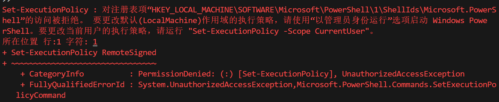
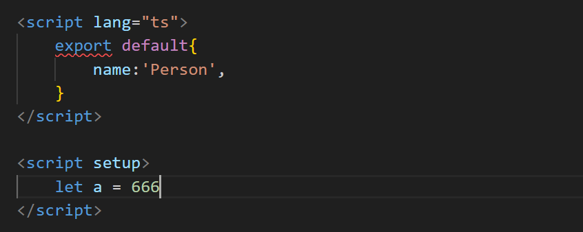
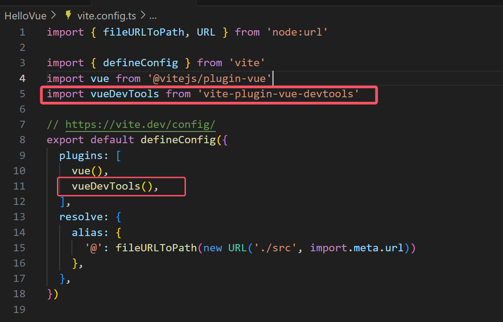

# 问题

## 关于Windows系统执行策略导致vscode无法运行

在vscode终端中如果报错如下



这个错误是由于Windows系统的执行策略限制导致的

需要按win+x以管理员身份打开powershell然后输入以下代码

```
Set-ExecutionPolicy RemoteSigned -Scope CurrentUser
```

```
Get-ExecutionPolicy -List
```

执行后，你应该能看到CurrentUser的执行策略已经变为RemoteSigned


## 关于在vue3中多个script定义时用于命名的export报错



这里报错

```
[@vue/compiler-sfc] <script> and <script setup> must have the same language type.
```

原因是因为上面定义的 <script>中用的是 ts 的语法，而下面定义的<script setup> 中用的是 js 的语法。


部分版本低的软件可能不会自动引入部分差距，以下是插件引入方法

```
在VScode终端中输入以下代码
npm i vite-plugin-vue-setup-extend -D
```

安装完成后，需要在vite.config.ts中引入该插件(高版本则会自动引入)



